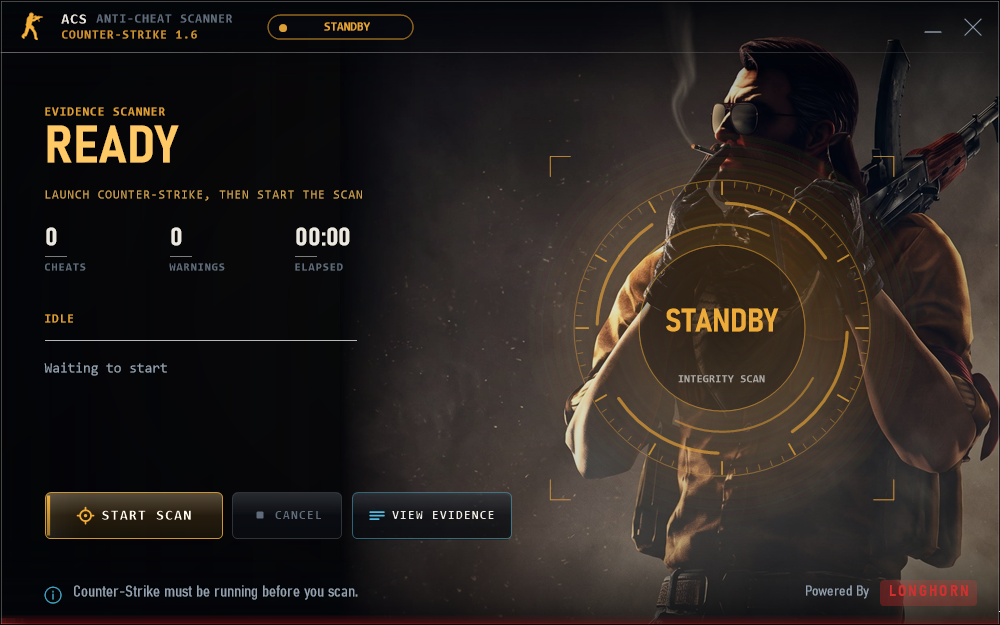

# LongHorn ACS

Counter-Strike 1.6 / GoldSrc anti-cheat evidence scanner for Windows.

**Public distribution and transparency repository.** Scanner source, detection databases, server code, credentials and player reports are not published here. This repository is not an open-source release of the scanner.

## Release status

Version **3.3.1-beta.1** is a transparency beta. The app is **unsigned** and **not independently audited**. No verified antivirus analysis for this exact build is claimed. A GitHub download or matching checksum is not a guarantee of safety.

[Download the tagged beta](https://github.com/cstrikelonghorn/LongHorn-ACS/releases/tag/v3.3.1-beta.1) · [Verification](VERIFY.md) · [Data access and privacy](PRIVACY.md) · [Security reporting](SECURITY.md) · [Release notes](RELEASE_NOTES.md)

## Start

1. Download `ACS-Scanner-3.3.1-beta.1-win-x64.zip` from the tagged GitHub release and compare its SHA-256 with `CHECKSUMS.sha256`.
2. Extract the complete ZIP. Keep the executable, libraries, settings and Assets folder together.
3. Obtain a report API address from your trusted server operator. Set `apiUrl` in `acp-settings.json`; keep operator-issued credentials private. The public package has no configured endpoint.
4. Start Counter-Strike, open `ACPScanner.exe`, and read the disclosure before scanning.
5. Inspect the complete report preview. Choose **Upload this report** only if you accept sending it to the displayed operator. **Do not upload** closes the preview without transmitting the report.

The rule download itself contacts the configured server before report review. Review `PRIVACY.md` for the data collected and operator-controlled retention.

## What the evidence means

ACS inventories game artifacts and reviews code changes, scripts and suspicious signals. Warnings require interpretation. A scan with no findings does not prove that a device or player is cheat-free. The app is not affiliated with or endorsed by Valve, GitHub, or Microsoft.

## What is public

The website, documentation, per-release checksums, file manifest, dependency inventory, and release binaries. The optional server plugin and driver scaffold are not bundled. Only sanitized synthetic examples belong in public issues.

## Website

Static HTML is in `docs/`. GitHub Pages can publish `main:/docs`. It contains no PHP API or report collection endpoint. [GitHub Pages](https://docs.github.com/en/pages/getting-started-with-github-pages/creating-a-github-pages-site) cannot host the private PHP scanner backend.
