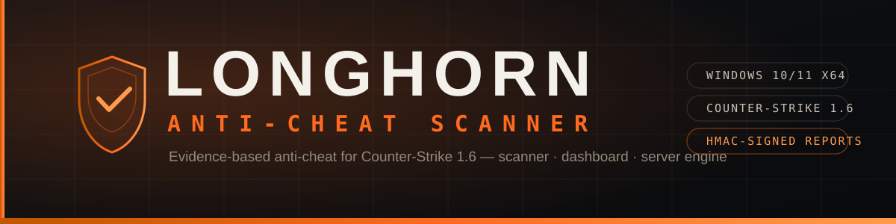
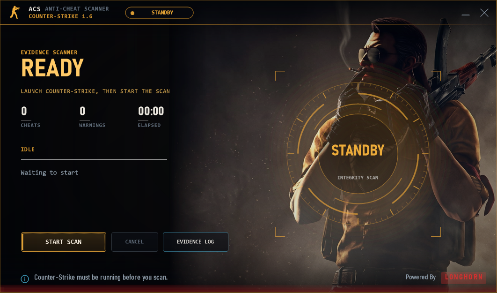
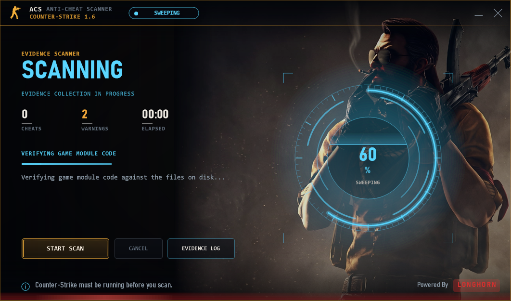
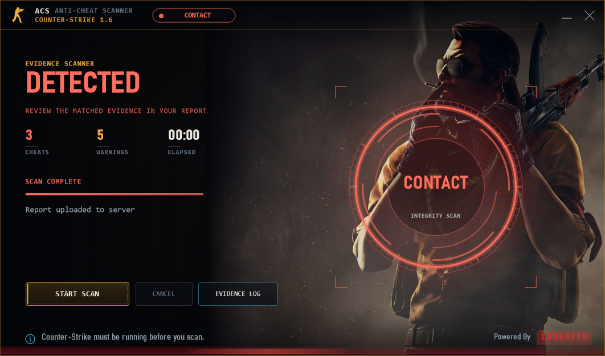

<div align="center">
  

  <a href="#-download"></a>&nbsp;
  <a href="#-the-app"></a>&nbsp;
  <a href="#-faq"></a>&nbsp;
  <a href="https://www.cslonghorn.com"></a>

  <br/><br/>

  
  
  
  
  

  **Evidence-based anti-cheat for Counter-Strike 1.6.**
  A Windows scanner, a PHP report dashboard and a ReHLDS server engine —
  built to collect strong evidence, explain it clearly, and leave every ban to a human.

</div>

<br/>

## 🧭 Overview

| | |
|:---|:---|
| 🖥️ **Desktop scanner**<br/>`windows/` (C#/.NET) | Attaches to a running `hl.exe`, inventories the game, checks it against a signature database and an artifact corpus, then uploads a **signed** report. |
| 🌐 **Web dashboard**<br/>repo root (PHP) | Stores reports, shows exactly what was found, ranks lower-confidence items for review, and supports search, compare, history and PDF export. |
| 🛡️ **Server engine**<br/>`server/` (C++) | An optional ReHLDS/Metamod plugin that analyses how a player actually plays — aim, recoil, movement, timing — with no client cooperation. |

> [!IMPORTANT]
> **Evidence, not a verdict.** A report is a set of observations. Bans are always a human decision made by the server operator.

## 📸 The App

| Idle | Scanning |
|:---:|:---:|
|  |  |

| Detected | Review |
|:---:|:---:|
|  |  |

<div align="center">

More screenshots in [`docs/img/`](docs/img) · full walk-through in the [**FAQ**](docs/FAQ.md)

</div>

## 🔍 What it scans

| | |
|:---|:---|
| 🧩 **Module integrity** | Engine code compared **byte-for-byte** against the file on disk — inline hooks, detours, mid-function patches, IAT and EAT hooks. |
| 🧠 **Memory evidence** | Private executable regions that back no file on disk — the manual-map signature. |
| 👁️ **External-cheat probes** | Processes holding read/write handles on the game, foreign threads, overlay windows. |
| 📜 **Script analysis** | Alias graphs matched on control-flow shape — bunny-hop, rapid-fire, no-recoil scripts caught regardless of naming. |
| 🗂️ **Files & drivers** | Live `cstrike` inventory with hashes; kernel drivers with signer and signature state. |
| 🎮 **Client recognition** | Steam, NextClient, GSClient, GoldClient, RevEmu/RevCrew, SmartSteamEmu, Goldberg — identified, not flagged. |
| 🗃️ **Artifact corpus** | Every hash ever seen, classified clean / cheat / unknown by prevalence across **distinct machines**. |
| 📈 **Player risk** | Client scan risk and server behaviour combined into one explainable score per SteamID. |

## ⚙️ How it works

```text
  Windows scanner                     Web dashboard                 ReHLDS plugin
  ───────────────                     ─────────────                 ─────────────
  attach hl.exe                       verify HMAC                   usercmd stream
  inventory + integrity               store report                  aim / recoil / move
  signatures + corpus                 classify + rank               long-term stats
        │                                   ▲                             │
        │        signed report (HMAC)       │      signed telemetry       │
        └───────────────────────────────────┘◄────────────────────────────┘
                            one risk score per SteamID
```

## 🚀 Getting started

<details open>
<summary><b>Desktop scanner</b></summary>

<br/>

```jsonc
// windows/acp-settings.json
{
  "apiUrl": "https://your-host/acp/api.php",
  "apiToken": "THE_SAME_VALUE_AS_ACP_API_TOKEN"
}
```

1. Launch **Counter-Strike 1.6** — the scanner only runs while the game is open.
2. Run the scanner and press **Scan**; play normally during the live-behaviour stage.
3. The signed report uploads automatically when the scan finishes.

> [!TIP]
> Run as **administrator** for the deepest memory and process evidence.

</details>

<details>
<summary><b>Web dashboard (PHP 8.2+)</b></summary>

<br/>

```bash
# 1. Upload the web files to your host (not windows/ or server/)
# 2. Make sure reports/ is writable
# 3. Verify:
curl "https://your-host/acp/api.php?action=health"

# 4. Secrets (fail-closed: uploads are local-only until a token exists)
ACP_API_TOKEN=<long random secret>     # upload + signing token (shared with the client)
ACP_ADMIN_TOKEN=<long random secret>   # dashboard / review / classification
```

Full guide: [docs/DEPLOYMENT.md](docs/DEPLOYMENT.md) — use **HTTPS** in production.

</details>

<details>
<summary><b>Server engine (ReHLDS)</b></summary>

<br/>

```bash
curl -o resources.ini "https://your-host/acp/rechecker.php?action=resources"
# → cstrike/addons/rechecker/resources.ini
```

Review the file before deploying and start with `amx_kick`, not a ban. See [`server/`](server/).

</details>

## 📚 Documentation

| | |
|:---|:---|
| 📥 [**Download & Install**](docs/DOWNLOAD.md) | Requirements, configuration, verification, troubleshooting |
| ❓ [**FAQ**](docs/FAQ.md) | How it works, how to use it, tutorials, common questions |
| 🏗️ [**Architecture**](docs/ARCHITECTURE.md) | Components, data flow, storage, risk model |
| 🔍 [**Detection**](docs/DETECTION.md) | Every detection channel explained |
| 🖥️ [**Deployment**](docs/DEPLOYMENT.md) | Hosting, secrets, nginx/Apache rules |
| 🔐 [**Security**](SECURITY.md) | Threat model, report integrity, disclosure |
| 📝 [**Changelog**](CHANGELOG.md) | Release history |

## 🗺️ Project status

**In development — not production-ready.** APIs, rules and UI can change without notice.

- [x] Detection engine: module integrity, hooks, memory, scripts, external probes
- [x] Web dashboard: reports, search, compare, export, risk model
- [x] Client & emulator recognition (NextClient, GSClient, RevEmu, SSE, …)
- [ ] Signed release builds with checksums
- [ ] Complete ReHLDS behavioural rule set
- [ ] Public documentation pass

## 🛡️ Security & privacy

- Reports are **HMAC-SHA256 signed** — tamper-evident, enforceable server-side.
- Upload token and admin token are **separate secrets**.
- Player IPs are stored and displayed **masked** (`109.187.61.***`).
- Report storage is kept **outside direct web access**; non-web folders ship deny-all rules.
- Report a vulnerability per [SECURITY.md](SECURITY.md) — please don't open public issues.

---

<div align="center">

**[⬇️ Download](docs/DOWNLOAD.md)** · **[❓ FAQ](docs/FAQ.md)** · **[📖 Docs](docs/ARCHITECTURE.md)** · **[🌐 cslonghorn.com](https://www.cslonghorn.com)**

<sub>Copyright © 2026 <b>LongHorn</b> — all rights reserved. Not affiliated with or endorsed by Valve Corporation.<br/>
Counter-Strike, Half-Life and Steam are trademarks of their respective owners.</sub>

</div>
