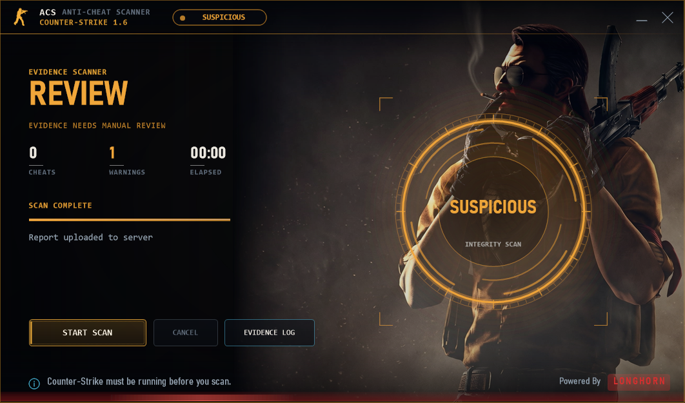

  

  &nbsp;
  &nbsp;
  &nbsp;
  

    

  
  
  
  

  **Evidence-based anti-cheat for Counter-Strike 1.6.**
  A Windows scanner, a web report dashboard and a ReHLDS server engine —
  built to collect strong evidence, explain it clearly, and leave every ban to a human.

 

> [!IMPORTANT]
> **Public distribution and transparency repository.** Scanner source, detection databases, server code, credentials and player reports are **not** published here. This repository is not an open-source release of the scanner.

## 🧭 What is ACS?

| | |
|:---|:---|
| 🖥️ **Desktop scanner** | A Windows app that attaches to a running `hl.exe`, inventories the game, and checks it against a signature database and an artifact corpus before uploading a signed report. |
| 🌐 **Report dashboard** | The operator-side web service that stores reports, shows what was found, and separates confirmed detections from lower-confidence review items. |
| 🛡️ **Server engine** | An optional ReHLDS plugin that analyses how a player actually plays — aim, recoil, movement, timing — with no client cooperation. |

## 📸 The App

| Ready | Scanning |
|:---:|:---:|
|  |  |

| Detected | Review |
|:---:|:---:|
|  |  |

Every scan ends in a written disclosure: you choose whether the report is uploaded, and to which operator.

## 🔍 What the scanner checks

| | |
|:---|:---|
| 🧩 **Module integrity** | Engine code compared **byte-for-byte** against the file on disk — inline hooks, detours, mid-function patches, IAT and EAT hooks. |
| 🧠 **Memory evidence** | Private executable regions that back no file on disk — the manual-map signature. |
| 👁️ **External-cheat probes** | Processes holding read/write handles on the game, foreign threads, overlay windows. |
| 📜 **Script analysis** | Alias graphs matched on control-flow shape — bunny-hop, rapid-fire, no-recoil scripts caught regardless of naming. |
| 🗂️ **Files & drivers** | Live game-folder inventory with hashes; kernel drivers with signer and signature state. |
| 🎮 **Client recognition** | Steam, NextClient, GSClient, GoldClient, RevEmu/RevCrew, SmartSteamEmu, Goldberg — identified, not flagged. |
| 🗃️ **Artifact corpus** | Every hash ever seen, classified clean / cheat / unknown by prevalence across **distinct machines**. |

## 🚀 Start

1. Download `ACS-Scanner-3.3.1-beta.1-win-x64.zip` from the [tagged beta release](https://github.com/cstrikelonghorn/LongHorn-ACS/releases/tag/v3.3.1-beta.1) and compare its SHA-256 with [`CHECKSUMS.sha256`](CHECKSUMS.sha256).
2. Extract the complete ZIP. Keep the executable, libraries, settings and Assets folder together.
3. Obtain a report API address from your trusted server operator. Set `apiUrl` in `acp-settings.json`; keep operator-issued credentials private. The public package has no configured endpoint.
4. Start Counter-Strike, open `ACPScanner.exe`, and read the disclosure before scanning.
5. Inspect the report preview. Choose **Upload this report** only if you accept sending it to the displayed operator. **Do not upload** closes the preview without transmitting.

## 🛡️ Transparency

Version **3.3.1-beta.1** is a transparency beta. The app is **unsigned** and **not independently audited**. No verified antivirus analysis for this exact build is claimed. A GitHub download or matching checksum is not a guarantee of safety.

| | |
|:---|:---|
| 📦 [**Release**](https://github.com/cstrikelonghorn/LongHorn-ACS/releases/tag/v3.3.1-beta.1) | Tagged beta binaries |
| 🔐 [**CHECKSUMS.sha256**](CHECKSUMS.sha256) | Verify your download |
| 📋 [**FILE-MANIFEST.json**](FILE-MANIFEST.json) | Exact file manifest of the build |
| 🧾 [**DEPENDENCIES.json**](DEPENDENCIES.json) | Dependency inventory |
| ✅ [**VERIFY.md**](VERIFY.md) | Step-by-step verification |
| 🔎 [**VALIDATION.md**](VALIDATION.md) | What was validated, and how |
| 🔏 [**PRIVACY.md**](PRIVACY.md) | Data collected, retention, operator control |
| 🚨 [**SECURITY.md**](SECURITY.md) | Security reporting |
| 📝 [**RELEASE_NOTES.md**](RELEASE_NOTES.md) | What changed in this beta |

## ❓ FAQ

<b>Is the scanner a virus or malware?</b>

No. It is a read-only inspection tool. It opens the game process to read memory, hashes files and uploads a report — it does not inject code, modify the game, or run in the background.

<b>Does it ban players automatically?</b>

No. ACS produces evidence. A confirmed detection is strong evidence; every ban or kick is a human operator's decision.

<b>Will it flag Steam, Discord or MSI Afterburner?</b>

No. Known overlays, injectors and CS 1.6 clients are recognised by name and hash, and common files seen on many distinct machines are learned as clean instead of being flagged for rarity.

<b>Does it work with non-Steam clients and emulators?</b>

Yes — NextClient, GSClient, GoldClient, RevEmu/RevCrew, SmartSteamEmu and Goldberg are identified so their own engine changes are not treated as cheating.

<b>Do I need administrator rights?</b>

The scan runs without elevation, but running as administrator allows deeper memory and process inspection and produces more complete evidence.

<b>Does the game have to be running?</b>

Yes. The scanner attaches to a live <code>hl.exe</code> — start Counter-Strike first.

<b>What data leaves my PC?</b>

Only what the report preview shows you, and only to the operator you accept. Nothing is transmitted without your explicit choice. Details in <a href="PRIVACY.md">PRIVACY.md</a>.

<b>Why is the build unsigned?

This is an early transparency beta; code signing comes with the stable release. Verify the SHA-256 checksum against <a href="CHECKSUMS.sha256">CHECKSUMS.sha256</a> instead.

<b>Where is the source code?

This is a distribution and transparency repository. The scanner source is not published here.

---

**[⬇️ Download](https://github.com/cstrikelonghorn/LongHorn-ACS/releases/tag/v3.3.1-beta.1)** · **[✅ Verify](VERIFY.md)** · **[🔏 Privacy](PRIVACY.md)** · **[🚨 Security](SECURITY.md)** · **[🌐 cslonghorn.com](https://www.cslonghorn.com)**

Copyright © 2026 <b>LongHorn</b> — all rights reserved. Not affiliated with or endorsed by Valve, GitHub or Microsoft. 
Counter-Strike, Half-Life and Steam are trademarks of their respective owners.

